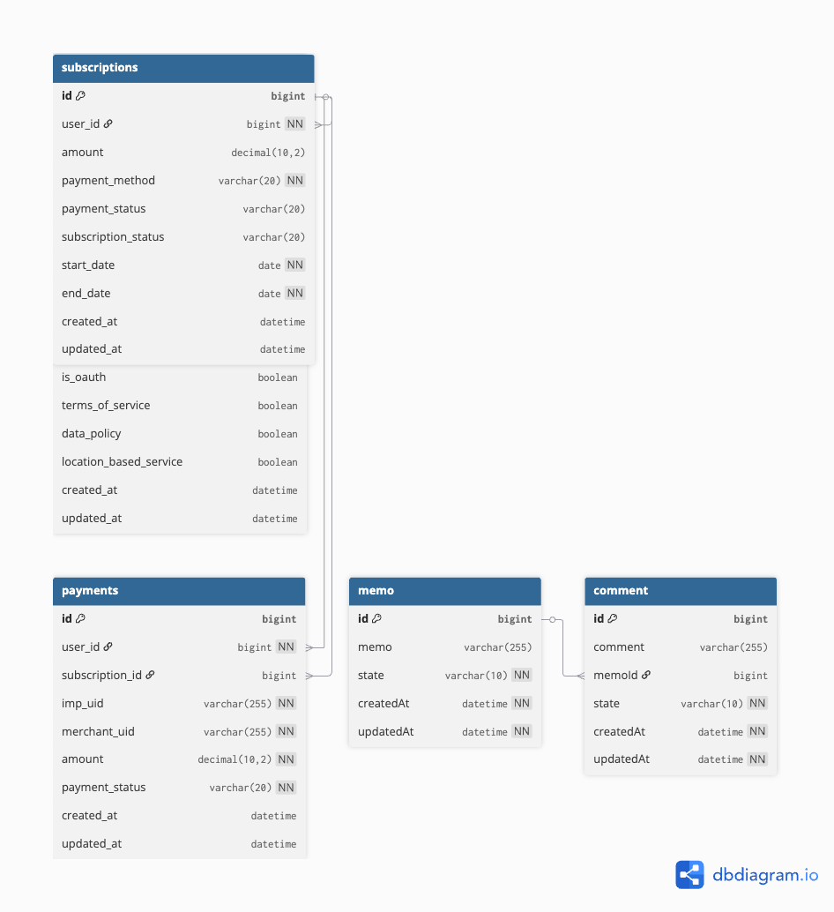

# 🏛️ Pukyong Gridge Server

부경대학교 그릿지 인턴십 프로젝트 - Spring Boot 기반 사용자 관리 및 결제 시스템

## 📋 프로젝트 개요

Spring Boot를 활용한 RESTful API 서버로, 사용자 관리, 결제 시스템, 구독 관리 기능을 제공합니다.

## 🛠️ 기술 스택

### Backend
- **Java 11** - OpenJDK
- **Spring Boot 2.7.5** - 웹 애플리케이션 프레임워크
- **Spring Data JPA** - 데이터 접근 계층
- **Hibernate** - ORM
- **Spring Security** - 보안 (JWT)
- **MySQL 8.0** - 관계형 데이터베이스
- **Gradle** - 빌드 도구

### API & Documentation
- **Swagger/OpenAPI 3** - API 문서화
- **Postman** - API 테스트

### Cloud & Deployment
- **AWS EC2** - 클라우드 서버 (t3.small)
- **Ubuntu 24.04 LTS** - 운영체제

### External Services
- **PortOne** - 결제 게이트웨이 연동

## 🌐 서버 정보

- **배포 서버**: `http://13.209.75.85:9000`
- **Swagger API 문서**: `http://13.209.75.85:9000/swagger-ui/index.html`

## 🏗️ 프로젝트 구조

```
src/main/java/com/example/demo/
├── DemoApplication.java           # 메인 애플리케이션
├── common/                        # 공통 모듈
│   ├── config/                    # 설정 클래스
│   ├── entity/                    # 기본 엔티티
│   ├── exceptions/                # 예외 처리
│   ├── oauth/                     # OAuth 로그인
│   └── response/                  # 공통 응답 형식
├── src/                          # 도메인별 소스
│   ├── user/                     # 사용자 관리
│   │   ├── entity/User.java      # 사용자 엔티티
│   │   ├── UserController.java   # REST 컨트롤러
│   │   ├── UserService.java      # 비즈니스 로직
│   │   ├── UserRepository.java   # 데이터 접근
│   │   └── model/                # DTO 클래스들
│   ├── payment/                  # 결제 시스템
│   │   ├── entity/Payment.java   # 결제 엔티티
│   │   ├── PaymentController.java
│   │   ├── PaymentService.java
│   │   ├── PaymentRepository.java
│   │   └── model/                # 결제 관련 DTO
│   ├── subscription/             # 구독 관리
│   │   ├── entity/Subscription.java
│   │   ├── SubscriptionRepository.java
│   │   └── model/
│   └── test/                     # 테스트 도메인
└── utils/                        # 유틸리티
    ├── JwtService.java           # JWT 토큰 관리
    ├── SHA256.java               # 암호화
    └── PersonalInfoEncryption.java # 개인정보 암호화
```

## 🗄️ 데이터베이스 스키마

### 주요 테이블

#### Users (사용자)
- `id` (PK) - 사용자 ID
- `username` - 사용자명 (unique)
- `email` - 이메일 (unique, 암호화)
- `password_hash` - 비밀번호 해시 (SHA-256)
- `name` - 이름 (AES-256 암호화)
- `phone_number` - 전화번호 (AES-256 암호화)
- `status` - 계정 상태 (ACTIVE/SUSPENDED/WITHDRAWN)
- `is_oauth` - OAuth 로그인 여부
- `created_at`, `updated_at` - 생성/수정 시간

#### Payments (결제)
- `id` (PK) - 결제 ID
- `user_id` (FK) - 사용자 ID
- `imp_uid` - PortOne 결제 고유번호 (unique)
- `merchant_uid` - 상점 주문번호
- `amount` - 결제 금액
- `payment_status` - 결제 상태 (READY/PAID/CANCELLED/FAILED)
- `subscription_id` (FK) - 구독 ID
- `created_at`, `updated_at` - 생성/수정 시간

#### Subscriptions (구독)
- `id` (PK) - 구독 ID
- `user_id` (FK) - 사용자 ID
- `payment_method` - 결제 수단
- `amount` - 구독 금액
- `start_date`, `end_date` - 구독 기간
- `status` - 구독 상태
- `created_at`, `updated_at` - 생성/수정 시간

## 🔌 API 엔드포인트

### 👤 사용자 관리
- `POST /app/users` - 회원가입
- `POST /app/users/logIn` - 로그인
- `GET /app/users/{userId}` - 사용자 조회
- `PATCH /app/users/{userId}` - 사용자 정보 수정
- `DELETE /app/users/{userId}` - 사용자 삭제
- `GET /app/users/auth/{socialLoginType}/login` - 소셜 로그인

### 💳 결제 시스템
- `POST /payments` - 결제 생성
- `GET /payments/{paymentId}` - 결제 조회
- `GET /payments/user/{userId}` - 사용자별 결제 목록
- `POST /payments/verify` - 결제 검증
- `POST /payments/{paymentId}/cancel` - 결제 취소
- `GET /payments/status/{status}` - 상태별 결제 조회

### 🧪 테스트 API
- `GET /test/memos` - 메모 목록 조회
- `POST /test/memos` - 메모 생성
- `PATCH /test/memos/{memoId}` - 메모 수정
- `POST /test/comments` - 댓글 생성

## 🎯 주요 기능

### 🔐 보안 기능
- **JWT 기반 인증** - 토큰 기반 사용자 인증
- **비밀번호 암호화** - SHA-256 해싱
- **개인정보 보호** - AES-256 암호화 (이름, 이메일, 전화번호)
- **입력값 검증** - 정규식 및 어노테이션 기반 검증

### 💰 결제 시스템
- **PortOne 연동** - 안전한 결제 처리
- **결제 상태 관리** - 실시간 결제 상태 추적
- **결제 검증** - 서버사이드 결제 검증
- **결제 취소** - 결제 취소 및 환불 처리

### 📊 구독 관리
- **구독 생성/조회** - 사용자별 구독 관리
- **구독 상태 추적** - 활성/만료/취소 상태 관리
- **결제 연동** - 구독과 결제 연결

## 🚀 실행 방법

### 로컬 환경
```bash
# 프로젝트 클론
git clone https://github.com/1Irving1/pukyong-gridge-server.git
cd pukyong-gridge-server

# 애플리케이션 실행
./gradlew bootRun
```

### 서버 환경
```bash
# 빌드
./gradlew build

# JAR 실행
java -jar build/libs/demo-0.0.1-SNAPSHOT.jar --spring.profiles.active=dev
```

## ⚙️ 환경 설정

### application.yml
```yaml
spring:
  datasource:
    url: jdbc:mysql://localhost:3306/admin_db
    username: root
    password: your_password
  jpa:
    hibernate:
      ddl-auto: create-drop
server:
  port: 9000
```

## 🧪 API 테스트

### Swagger UI
브라우저에서 `http://13.209.75.85:9000/swagger-ui/index.html` 접속

### Postman Collection
프로젝트 루트의 `Pukyong-Gridge-Server.postman_collection.json` 파일 Import

## 📋 ERD (Entity Relationship Diagram)



## 🛡️ 보안 고려사항

### 개인정보 암호화
- **이름, 이메일, 전화번호**: AES-256 암호화 저장
- **비밀번호**: SHA-256 해싱 후 저장
- **JWT 토큰**: 안전한 토큰 기반 인증

### 데이터 검증
- **이메일 형식 검증**: 정규식 패턴 매칭
- **비밀번호 강도**: 최소 길이 및 복잡도 요구
- **SQL Injection 방지**: JPA 사용으로 안전한 쿼리 실행

## 🔄 개발 가이드라인

### 코드 컨벤션
- **3-Layer Architecture**: Controller → Service → Repository
- **RESTful API**: HTTP 메서드와 상태코드 준수
- **Exception Handling**: 전역 예외 처리기 활용
- **Logging**: 요청/응답 로깅 및 에러 추적

### 커밋 메시지
```
feat: 새로운 기능 추가
fix: 버그 수정
docs: 문서 수정
style: 코드 포맷팅
refactor: 코드 리팩토링
test: 테스트 코드
```

## 🚧 현재 제한사항

- SSL/HTTPS 미적용 (HTTP만 지원)
- 파일 업로드 기능 미구현
- 실시간 알림 시스템 미구현
- 관리자 페이지 미구현

## 📅 향후 개발 계획

- [ ] HTTPS 적용 및 SSL 인증서 설정
- [ ] Redis 캐싱 시스템 도입
- [ ] 실시간 알림 (WebSocket) 구현
- [ ] 관리자 대시보드 개발
- [ ] 모바일 앱 API 확장
- [ ] 성능 최적화 및 모니터링

## 👥 개발자 정보

- **개발자**: 정상훈
- **이메일**: -
- **GitHub**: [@1Irving1](https://github.com/1Irving1)
- **프로젝트 기간**: 2025년 8월

## 📄 라이선스

이 프로젝트는 부경대학교 그릿지 인턴십 과정의 일부로 개발되었습니다.

---

**🎯 부경대학교 그릿지 인턴십 프로젝트 - Spring Boot 기반 백엔드 시스템**